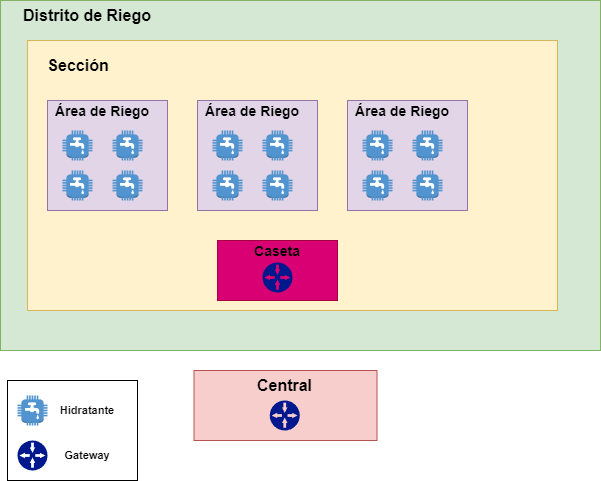
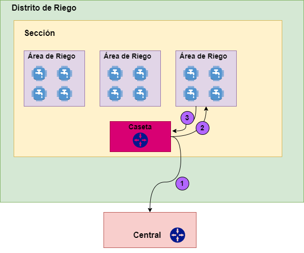

# Valsi Smart Hydratant - Documento de Definiciones y Diagramas

## Definiciones

### Distrito de Riego

Un área irrigada por una sola fuente de agua, que puede contener múltiples secciones de riego.

### Sección

Una división del distrito de riego, que puede comprender varias áreas de riego.

### Área

Una subdivisión de la sección de riego, que puede ser gestionada individualmente.

### Central

Un edificio equipado con una antena central que se comunica con los gateways y coordina el sistema de riego.

### Caseta

Una estructura ubicada cerca de las secciones de riego que puede albergar un gateway y sirve como punto de comunicación dentro del sistema.

### Hidrante

Un elemento de control del sistema de riego que contiene una PCB para comunicación, control de válvulas y medición de agua.

### Programa de Riego

Una configuración que determina la cantidad de agua a regar y la ventana de tiempo ideal para el riego.

### Lámina de Riego

Una unidad de medida de agua utilizada en agricultura para determinar la cantidad de agua aplicada durante el riego.

### Estatus de Riego

Indica si una sección o área está actualmente en proceso de riego o no.

### Modo de Riego

Puede ser manual o automático, determinando si el riego se realiza de forma programada o requiere intervención humana.

### Infraestructura

El conjunto de elementos físicos que componen el sistema de riego, incluyendo gateways, casetas, hidrantes y centrales.

### Comunicación

Los distintos canales y tipos de mensajes utilizados para la transmisión de datos dentro del sistema de riego.

### Usuarios

Existen dos tipos de usuarios: administradores y usuarios normales, cada uno con diferentes niveles de acceso y permisos dentro del sistema.

## Diseño del terreno del sistema

A continuación se presenta el diseño del terreno así como la ubicación y relación de cada uno de los componentes del sistema:

- Actualmente el terreno (Distrito de riego) se divide en 19 secciones con 2100 hidrantes, es decir un aproximado de 120 hidrantes por seccion
- Existe un gateway por sección, y la distancia máxima actual entre un gateway y un hidrante está entre 4 y 5 km
- Existe una caseta principal

## Canales y Tipos de mensajes del sistema

En este sistema se requiren 3 tipos de mensajes LoRa/LoRaWAN que serán enviados entre caseta, central e hidratantes.

### 1. De caseta a central

- Envío de datos meteorologicos locales

### 2. De caseta a hidrante

- Programa de riego

### 3. De hidrante a caseta

- Eventos de riego
- Cantidad de agua regada
- Eventos de puerta (puerta cerrada/abierta)
- Estatus de bateia

## Frecuencia de envio de datos

- Actual - una vez al día, 12 del día para establecer programa de riego nocturno
- Ideal - Propuesta del equipo de SK manteniendo como mínimo el actual
